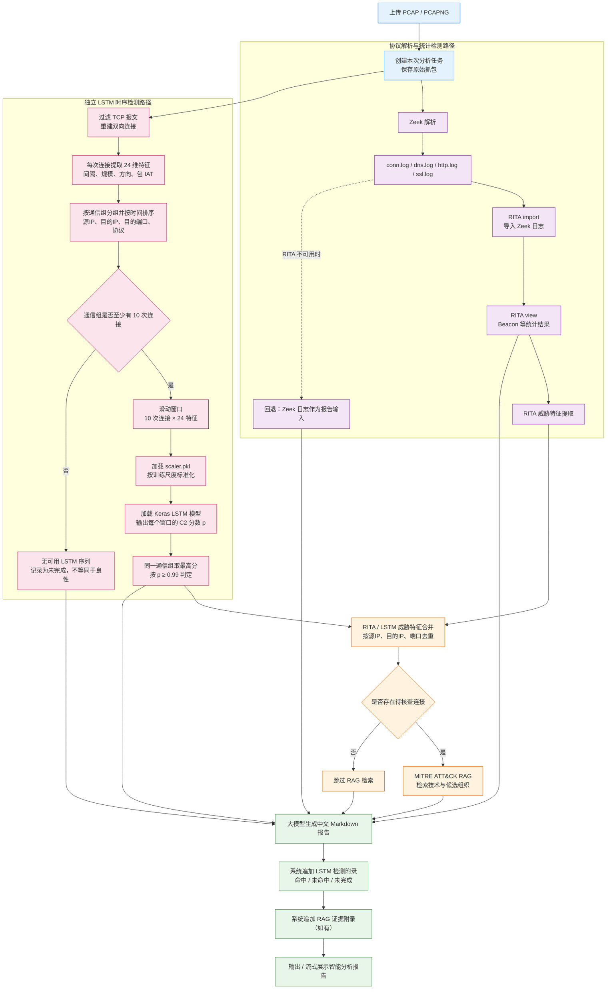

# C2Sherlock：隐蔽 C2 通信检测与辅助溯源系统

C2Sherlock 是一个面向 PCAP 流量的 C2（Command and Control，命令与控制）分析系统。它将 Zeek、RITA、基于 LSTM 的 TCP Beacon 时序检测、MITRE ATT&CK RAG 检索与大模型报告生成整合到同一条分析链路中。

系统的目标不是仅凭单个指标断言攻击，而是将统计检测、连接时序行为与威胁情报检索作为相互补充的证据，帮助分析人员优先定位和核查可疑通信。

## 当前分析流程



其中 RITA 与 LSTM 独立工作：

- RITA 基于 Zeek 日志进行统计型 Beacon 分析。
- LSTM 直接从原始 PCAP 重建 TCP 连接并提取时序特征，**不依赖 RITA 的特征导出**；DNS/UDP 流量仍由 Zeek、RITA 与 RAG 路径覆盖。
- RAG 对 RITA/LSTM 合并后的可疑通信检索 MITRE ATT&CK 知识库，提供技术与候选组织线索；候选组织不是已确认归因。

## LSTM Beacon 检测

### 检测对象与输入

LSTM 面向 TCP 连接序列中的 Beacon 行为。一次 TCP 连接是一行数据；同一通信关系按下列字段分组并按开始时间排序：

```text
source_file + src_ip + dst_ip + dst_port + ip_protocol
```

每连续 10 次连接构成一个窗口，因此模型输入形状为：

```text
10 个时间步 × 24 个特征
```

少于 10 次连接的通信组不能组成完整窗口，LSTM 会跳过该组；这不等于该通信安全。训练阶段中，单个超长通信组最多均匀抽取 200 个窗口，以免某一抓包主导训练。在线检测不会沿用该训练采样上限，而是检查全部窗口，每批最多预测 512 个窗口，并以每个通信组的最高窗口分数进行判定。

### 24 维特征

| 类别 | 数量 | 字段 | 用途 |
|---|---:|---|---|
| 连接间规律 | 7 | `flow_gap`、`log_flow_gap`、最近 5 次间隔的均值/标准差/CV/中位数/IQR | 判断重连周期及其波动程度。 |
| 连接规模与方向 | 7 | `duration`、收发包数、收发字节数、包数比例、字节比例 | 描述一次会话的规模及收发模式。 |
| 连接内部包间隔 | 9 | `packet_iat_min/max/mean/stddev`、`packet_iat_0`～`packet_iat_4` | 描述会话内的请求—响应节奏，辅助区分仅在跨连接周期上相似的正常心跳与 C2。 |
| 方向可靠度 | 1 | `direction_confidence` | 标记能否通过 TCP SYN 可靠识别发起方。 |

特征由 [backend/app/pcap_lstm_feature_extractor.py](backend/app/pcap_lstm_feature_extractor.py) 生成。训练集拟合并保存 `StandardScaler`，验证、测试和线上推理复用同一个 `scaler.pkl`，防止数据尺度不一致和数据泄漏。

### 模型与阈值

模型结构为：

```text
LSTM(32) → Dropout(0.4) → LSTM(16) → Dropout(0.4)
→ Dense(32, ReLU) → Dense(1, Sigmoid)
```

- 损失函数：二分类交叉熵（Binary Cross-Entropy）。
- 优化器：Adam，学习率 `0.001`。
- 正则化：L2 与 Dropout，减少过拟合。
- 训练：5 个固定随机种子重复训练，以验证集选择部署模型；测试集只用于最终评估。

当前部署阈值为 **`0.99`**，保存在 `decision_threshold.json` 中。该阈值是模型输出分数 `p` 转化为告警的标准：`p ≥ 0.99` 时，通信组被标记为潜在 C2 Beacon。

> `decision_threshold.json` 是阈值唯一来源。后端与离线预测脚本都会读取该文件；不要只改 `model_metadata.json` 的内容。

模型工件必须作为一个整体部署：

```text
beacon_lstm_model.keras  # 模型权重与结构
scaler.pkl               # 训练集标准化规则
model_metadata.json      # 特征顺序、窗口长度、输入形状等元数据
decision_threshold.json  # 部署阈值及其选择记录
```

后端加载时会校验模型输入形状、Scaler 特征数、元数据和阈值文件的一致性；不匹配时将禁用 LSTM 检测，而不会静默给出不可信结果。

### LSTM 结果如何写入报告

每份智能报告都会包含系统生成的“LSTM 时序检测结果”附录：

- **命中**：列出达到阈值的通信关系、置信度和风险等级；在当前 `0.99` 阈值下，命中项均为 `Critical`。
- **未命中**：明确说明已完成 LSTM 分析但没有通信组达到告警阈值，不会把“未命中”表述为绝对安全。
- **未完成**：若模型不可用、特征提取失败或没有足够长的通信组，报告会显示未完成，避免误判为良性。

报告的总体发现只应在开头“执行摘要”集中说明；系统附录保留逐条证据，不重复输出“共检出 X 条可疑连接”式的汇总。

## 项目结构

```text
Xonme/
├── frontend/                         # 静态 Web 前端
│   ├── index.html                    # 主分析页面
│   ├── app.js                        # 上传、SSE 进度与报告展示
│   └── dev_server.py                 # 禁用缓存的本地开发服务器
├── backend/
│   ├── app/
│   │   ├── main.py                   # FastAPI API 与主分析流水线
│   │   ├── pcap_lstm_feature_extractor.py  # PCAP → 24 维 TCP 连接特征
│   │   ├── lstm_predictor.py         # 后端 LSTM 推理与报告格式化
│   │   ├── threat_feature_merger.py  # RITA / LSTM 结果合并
│   │   ├── data_extractor.py         # RITA 威胁特征提取
│   │   ├── rag_engine.py             # ATT&CK RAG 检索
│   │   ├── report_export.py          # 报告导出
│   │   └── models/                   # 已部署的 LSTM 工件
│   ├── build_knowledge_base.py       # 构建 ChromaDB ATT&CK 知识库
│   └── requirements.txt
├── LSTM/
│   ├── data/                         # 原始 PCAP 与 split_manifest.csv
│   ├── feature_data/                 # 由 PCAP 提取的训练/验证/测试特征 CSV
│   ├── models/                       # 训练产物
│   ├── logs/                         # 训练历史、评估与假阴性记录
│   ├── config.py                     # 训练与特征配置
│   └── src/
│       ├── prepare_pcap_dataset.py   # PCAP → 标注特征 CSV
│       ├── data_prep.py              # 构造通信组与时序窗口、标准化
│       ├── model.py                  # LSTM 网络定义
│       ├── train.py                  # 重复训练、验证集选模型与阈值
│       └── predict.py                # 离线推理 / 评估
└── README.md
```

## 环境要求

- Python 3.10+（建议为后端和训练模块各建一个虚拟环境）
- Zeek：解析 PCAP 并生成协议日志
- RITA v5+：统计型 Beacon 分析，需要对应 ClickHouse 服务
- Docker：若使用容器化 RITA/ClickHouse
- 可访问的大模型 API：用于生成智能报告

Zeek/RITA 常在 Linux 或 WSL 环境部署。Windows 本地开发时，请确保 `zeek`、`rita` 命令可从后端进程的 `PATH` 调用。

Python 依赖分别见：

```text
backend/requirements.txt
LSTM/requirements.txt
```

## 快速启动

### 1. 配置后端

```bash
cd backend
python -m venv .venv
```

Linux/macOS：

```bash
source .venv/bin/activate
```

PowerShell：

```powershell
.venv\Scripts\Activate.ps1
```

安装依赖：

```bash
pip install -r requirements.txt
```

复制并填写环境变量：

```bash
cp .env.example .env
```

至少配置一个报告模型提供方，例如：

```dotenv
SILICONFLOW_BASE_URL=https://api.siliconflow.cn
SILICONFLOW_API_KEY=your-key
DEFAULT_MODEL_ID=deepseek-v4-flash
```

可选：配置 `DATABASE_URL` 以启用登录与分析历史；未配置时可使用游客分析模式。

### 2. 构建 ATT&CK RAG 知识库（首次运行）

准备 MITRE ATT&CK STIX 数据与本地 Embedding 模型后运行：

```bash
cd backend
python build_knowledge_base.py --stix-dir ../attack-stix-data
```

默认知识库位置为 `backend/chroma_db`，本地 Embedding 模型默认位置为 `backend/local_models/all-MiniLM-L6-v2`。

### 3. 确认 LSTM 工件已部署

`backend/app/models/` 必须包含以下四个文件：

```text
beacon_lstm_model.keras
scaler.pkl
model_metadata.json
decision_threshold.json
```

若刚完成训练，请将 `LSTM/models/` 中同一批次的四个文件同步到 `backend/app/models/`。不要混用不同训练批次的模型、Scaler 和元数据。

### 4. 启动服务

启动后端：

```bash
cd backend
uvicorn app.main:app --host 0.0.0.0 --port 8765 --reload
```

启动前端：

```bash
cd frontend
python dev_server.py
```

浏览器访问 `http://127.0.0.1:5500`。前端默认连接同一主机的 `8765` 端口。

## 使用方式

### Web 分析

打开前端页面后上传 `.pcap` 或 `.pcapng` 文件，界面会展示：

```text
Zeek → RITA → LSTM → RAG → AI 报告
```

### API 分析

普通响应接口：

```bash
curl -X POST http://127.0.0.1:8765/analyze \
  -F "pcap=@sample.pcap"
```

实时进度接口：

```bash
curl -N -X POST http://127.0.0.1:8765/analyze/stream \
  -F "pcap=@sample.pcap"
```

### 离线 LSTM 预测与评估

在项目根目录执行：

```bash
# 对一个已提取的 24 维特征 CSV 推理
python LSTM/src/predict.py path/to/lstm_features.csv

# 对已准备的验证集复现当前部署阈值下的窗口级指标
python LSTM/src/predict.py --split val
```

离线脚本与后端使用相同的模型工件、阈值文件和“通信组取最高窗口分数”的判定逻辑。

## 重新训练 LSTM

### 1. 准备数据与划分清单

将原始良性和恶意 PCAP 放入：

```text
LSTM/data/benign/
LSTM/data/malicious/
```

在 `LSTM/data/split_manifest.csv` 中为每个文件指定：

```text
file_name, label, split, source, scenario
```

`split` 必须为 `train`、`val` 或 `test`。同一 PCAP 不能跨集合，以避免训练集与测试集泄漏。

### 2. 生成特征数据

```bash
cd LSTM
python src/prepare_pcap_dataset.py
```

该脚本不会改写原始 PCAP，会在 `feature_data/` 生成对应 CSV，并在 `logs/pcap_feature_coverage.csv` 记录可形成时序窗口的通信组覆盖情况。

### 3. 训练与评估

```bash
cd LSTM
python src/train.py
```

训练会生成：

```text
models/beacon_lstm_model.keras
models/scaler.pkl
models/model_metadata.json
models/decision_threshold.json
logs/evaluation.json
logs/repeated_training_report.json
logs/training_history.json
logs/test_false_negative_windows.csv
```

训练完成后，验证模型工件后再整体同步到 `backend/app/models/`。

## 质量检查

```bash
python -m unittest backend/test_pcap_lstm_feature_extractor.py
python -m unittest backend/test_lstm_reporting.py
python LSTM/src/predict.py --split val
```

## 常见问题

### LSTM 未完成或没有结果

可能原因包括：

- 模型工件不完整，或模型、Scaler、元数据不是同一批次；
- PCAP 不包含 TCP 流量；
- 每个通信组少于 10 次连接，无法形成 LSTM 输入窗口；
- Scapy、Keras/TensorFlow 等依赖未安装。

这类情况会在报告中显示“LSTM 检测未完成”，不等同于良性结论。

### LSTM 未命中

表示已完成时序检测，但没有窗口达到当前 `0.99` 告警阈值。它不表示流量绝对安全；应结合 RITA、Zeek 日志、资产背景和其他检测证据判断。

### RITA 不可用

后端会回退到 Zeek 日志作为报告基础；LSTM 仍可从原始 PCAP 独立执行。请检查 RITA 命令、ClickHouse 服务及 RITA 的内部网段过滤配置。

### RAG 初始化失败

请确认 `backend/chroma_db` 已构建，`backend/local_models/all-MiniLM-L6-v2` 可用，并已安装 `chromadb` 与 `sentence-transformers`。

## 技术栈

- FastAPI、SQLAlchemy、原生 HTML/CSS/JavaScript
- Zeek、RITA、ClickHouse
- TensorFlow/Keras、scikit-learn、Scapy
- ChromaDB、Sentence-Transformers、MITRE ATT&CK STIX
- OpenAI 兼容接口 / SiliconFlow 等大模型服务

## 许可证与致谢

项目采用 MIT 许可证。感谢 Zeek、RITA、MITRE ATT&CK、TensorFlow/Keras、ChromaDB、Sentence-Transformers 与 ARES Dataset 等开源项目和数据资源。
