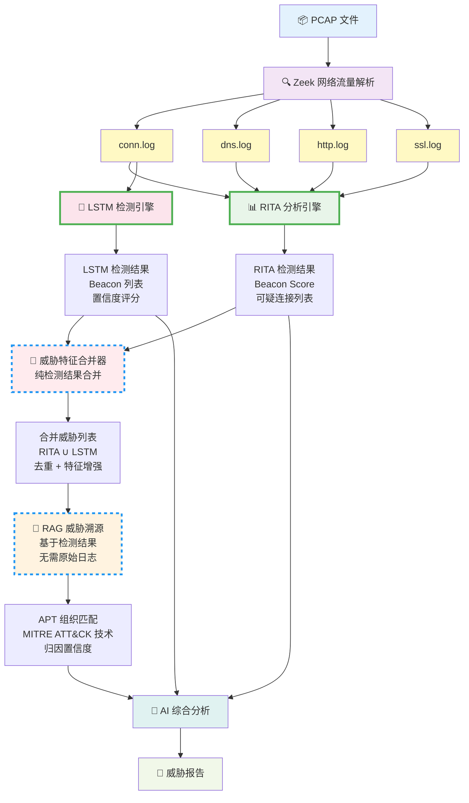

# C2Sherlock：面向隐蔽C2通信的智能检测与溯源系统

C2Sherlock 是一个集成了多层检测技术的网络威胁分析平台，专注于识别和溯源隐蔽的 C2（Command and Control）通信。系统结合了传统网络分析工具、深度学习模型和威胁情报检索，为安全分析人员提供自动化的威胁检测与归因能力。

## 系统架构



## 核心功能

### 1. **多层检测引擎**
- **Zeek**: 深度网络流量解析，生成 conn、DNS、HTTP、SSL/TLS 协议日志
- **RITA**: 基于统计的 beacon 检测，识别周期性通信模式
- **LSTM 模型**: 基于 ARES 数据集训练的深度学习模型，使用包间到达时间（IAT）特征进行时序分类
  - 输入特征: 15 维 `iat_oresp_*`（total, min, max, mean, stddev, nf_0~nf_9）
  - 检测目标: HTTP beacon、TCP C2 通信
  - 输出: 置信度评分 + 风险等级（Critical/High/Medium/Low）

### 2. **RAG 威胁溯源**
- 基于 MITRE ATT&CK STIX 2.1 数据集构建知识库
- 使用 ChromaDB + Sentence-Transformers 进行语义检索
- 从 RITA/Zeek 日志中提取威胁特征（beacon 评分、DNS 异常、TLS 指纹等）
- 匹配 APT 组织的 TTP（Tactics, Techniques, and Procedures）
- 输出归因结果：APT 组织名称、匹配的 ATT&CK 技术、置信度

### 3. **智能分析报告**
- 集成 SiliconFlow API（支持 Qwen/DeepSeek 等大模型）
- 自动生成结构化 Markdown 报告：
  - **Executive Summary**: 高层概述
  - **Key Threats Identified**: 关键威胁详情
  - **Risk Assessment**: 风险评级
  - **Threat Attribution**: APT 组织归因（基于 RAG 结果）
  - **Recommended Actions**: 处置建议

### 4. **友好的 Web 界面**
- 拖拽上传 PCAP 文件
- 实时显示分析进度（Zeek → RITA → LSTM → RAG → AI）
- Markdown 渲染威胁报告
- 支持导出分析结果

## 项目结构

```
C2Sherlock/
├── frontend/                # Web 前端
│   ├── index.html          # 主页面
│   ├── app.js              # 前端逻辑（文件上传、进度显示）
│   └── styles.css          # 样式
│
├── backend/                # FastAPI 后端
│   ├── app/
│   │   ├── main.py                     # API 入口（/analyze 接口）
│   │   ├── lstm_predictor.py           # LSTM beacon 检测
│   │   ├── rita_feature_exporter.py    # RITA ClickHouse 特征导出
│   │   ├── data_extractor.py           # RITA/Zeek 威胁特征提取
│   │   ├── rag_engine.py               # RAG 威胁溯源引擎
│   │   ├── attribution_prompts.py      # RAG prompt 模板
│   │   ├── feature_encoder.py          # 威胁特征编码器
│   │   ├── knowledge_base/
│   │   │   ├── stix_parser.py          # MITRE ATT&CK STIX 解析
│   │   │   └── vector_db.py            # ChromaDB 向量数据库
│   │   └── models/
│   │       ├── beacon_lstm_model.keras # 训练好的 LSTM 模型
│   │       ├── scaler.pkl              # StandardScaler
│   │       └── model_metadata.json     # 模型元数据
│   ├── requirements.txt
│   └── .env.example
│
├── LSTM/                   # LSTM 模型训练模块
│   ├── src/
│   │   ├── data_prep.py    # 数据预处理
│   │   ├── model.py        # LSTM 模型定义
│   │   ├── train.py        # 训练脚本
│   │   └── predict.py      # 预测脚本
│   ├── config.py           # 超参数配置
│   ├── requirements.txt
│   └── README.md
│
└── README.md               # 本文件
```

## 环境要求

### 系统依赖
- **操作系统**: Linux
- **Python**: ≥ 3.10
- **Zeek**: ≥ 8.0.6 (网络流量分析引擎)
- **RITA**: v5+ (Real Intelligence Threat Analytics)
- **Docker**: 用于运行 RITA ClickHouse 数据库

### Python 依赖
见 `backend/requirements.txt` 和 `LSTM/requirements.txt`

## 部署指南

### 1. 安装系统依赖

#### 安装 Zeek

见 [Zeek](https://github.com/zeek/zeek#getting-started)

#### 安装 RITA

见 [RITA](https://github.com/activecm/rita#quick-start)

#### 修改 RITA 配置（重要！）
为了分析内网流量，需要修改 RITA 的过滤配置：

```bash
# 备份原配置
sudo cp /etc/rita/config.hjson /etc/rita/config.hjson.bak

# 编辑配置文件
sudo vim /etc/rita/config.hjson
```

找到 `"filtering"` 部分，修改为：
```hjson
"filtering": {
    "internal_subnets": [
        "10.0.0.0/8",
        "172.16.0.0/12",
        "192.168.0.0/16",
        "fd00::/8"
    ],
    # 关键：添加 always_included_subnets 强制包含内网流量
    "always_included_subnets": [
        "10.0.0.0/8",
        "172.16.0.0/12",
        "192.168.0.0/16"
    ],
    "always_included_domains": [],
    "never_included_subnets": [],
    "never_included_domains": [],
    # 关键：禁用外部到内部流量的过滤
    "filter_external_to_internal": false
}
```

重启 RITA 服务：
```bash
docker restart rita-clickhouse
```

### 2. 配置后端

#### 创建虚拟环境
```bash
cd backend
python3 -m venv .venv
source .venv/bin/activate
```

#### 安装 Python 依赖
```bash
pip install -r requirements.txt
```

#### 配置环境变量
```bash
# 复制配置模板
cp .env.example .env

# 编辑 .env 文件
vim .env
```

填入以下配置：
```bash
# SiliconFlow API 配置（或其他 OpenAI 兼容 API）
SILICONFLOW_BASE_URL=https://api.siliconflow.cn
SILICONFLOW_API_KEY=sk-your-api-key-here
OPENAI_BASE_URL=https://api.openai.com/v1
OPENAI_API_KEY=your-openai-api-key
DEFAULT_MODEL_ID=deepseek-v4-flash

```

#### 构建 RAG 知识库（首次运行）
```bash
# 下载 MITRE ATT&CK STIX 数据
git clone https://github.com/mitre-attack/attack-stix-data.git

# 下载 Embedding 模型 
mkdir -p backend/local_models
HF_ENDPOINT=https://hf-mirror.com .venv/bin/python - <<'PY'
from huggingface_hub import snapshot_download
path = snapshot_download(
    repo_id='sentence-transformers/all-MiniLM-L6-v2',
    local_dir='backend/local_models/all-MiniLM-L6-v2',
    local_dir_use_symlinks=False,
    resume_download=True,
)
print(path)
PY

# 创建 chroma_db/ 目录，包含向量化的 ATT&CK 知识
cd backend
python build_knowledge_base.py
```

#### 启动后端服务
```bash
uvicorn app.main:app --host 0.0.0.0 --port 8765 --reload
```

后端服务监听 `http://127.0.0.1:8765`。

### 3. 启动前端

```bash
cd frontend
python3 dev_server.py
```

然后在浏览器访问 `http://127.0.0.1:5500`。前端会自动使用相同 IP 的 `8765` 端口访问后端，无需配置后端地址。
该开发服务器会禁用浏览器缓存；保存 CSS、HTML 或 JavaScript 后，直接刷新页面即可看到最新内容，无需手动修改 URL 版本号。

### 4. 验证部署

1. 打开前端页面 `http://127.0.0.1:5500`
2. 拖拽上传一个 PCAP 文件
3. 观察分析进度：Zeek → RITA → LSTM → RAG → AI
4. 查看生成的威胁报告

## 使用说明

### 分析 PCAP 文件

1. **准备 PCAP 文件**
   - 支持标准 PCAP 格式（.pcap, .pcapng）
   - 建议包含至少 10 分钟的网络流量
   - 对于 LSTM 检测，需要包含 HTTP/TCP 连接

2. **上传分析**
   - 在 Web 界面拖拽上传 PCAP 文件
   - 或使用 API：
     ```bash
     curl -X POST http://127.0.0.1:8765/analyze \
       -F "pcap=@your_traffic.pcap"
     ```

3. **查看结果**
   - Web 界面会实时显示分析进度
   - 最终生成包含以下部分的 Markdown 报告：
     - 威胁摘要
     - LSTM 检测到的 beacon 列表（如有）
     - RAG 溯源的 APT 组织（如有）
     - 处置建议

### 查看后端日志

后端日志会显示详细的分析过程：

```bash
# 启动后端时查看日志
uvicorn app.main:app --host 0.0.0.0 --port 8765 --reload

# 日志示例：
# ⏳ RITA: importing logs from /path/to/outputs/xxx ...
# ✓ RITA: import OK
# ✓ LSTM: using RITA DB feature export (iat_oresp_*)
# 📊 LSTM Beacon Detection Results:
# ...
# 🔍 RAG: matched! primary=APT28, confidence=85.3%
```

## LSTM 模型训练（可选）

如果需要重新训练 LSTM 模型（使用自己的数据集）：

```bash
cd LSTM

# 1. 准备数据：将良性和恶意流量的 CSV 放入对应目录
#    - LSTM/data/benign/*.csv
#    - LSTM/data/malicious/*.csv

# 2. 训练模型
python src/train.py

# 3. 复制训练产物到后端
cp models/* ../backend/app/models/
```

详见 `LSTM/README.md`

## 技术栈

### 后端
- **FastAPI**: Web 框架
- **Zeek**: 网络流量解析
- **RITA v5**: Beacon 检测（基于 ClickHouse）
- **TensorFlow/Keras**: LSTM 深度学习模型
- **ChromaDB**: 向量数据库（RAG 知识库）
- **Sentence-Transformers**: 文本嵌入模型
- **Requests**: HTTP 客户端（调用 LLM API）

### 前端
- **原生 HTML/CSS/JavaScript**: 无框架依赖
- **Marked.js**: Markdown 渲染
- **highlight.js**: 代码高亮

### AI 模型
- **LSTM**: 自训练 beacon 检测模型（ARES 数据集）
- **LLM**: SiliconFlow API（Qwen/DeepSeek/…）
- **Embedding**: all-MiniLM-L6-v2 (Sentence-Transformers)

## 常见问题

### Q1: RITA 无法分析内网流量？
**A**: 修改 `/etc/rita/config.hjson`，将内网地址段添加到 `always_included_subnets`，并设置 `filter_external_to_internal: false`。详见部署指南。

### Q2: LSTM 显示 "empty RITA DB feature export"？
**A**: 这表示 RITA 的 ClickHouse 数据库中没有时间间隔数据。可能原因：
- PCAP 文件只包含 DNS 流量（LSTM 需要 HTTP/TCP 连接）
- PCAP 文件流量太少
- 确保使用包含周期性 HTTP 请求的 PCAP 测试

### Q3: RAG 无法提取威胁特征？
**A**: 检查阈值配置。当前阈值（`backend/app/data_extractor.py`）：
- Beacon Score ≥ 70
- C2 DNS Score ≥ 0.5
- 如果仍然过滤过严，可以降低 `MIN_BEACON_SCORE` 等阈值

### Q4: 前端无法连接后端？
**A**: 前端会自动使用当前访问 IP 的 `8765` 端口连接后端。如果仍有问题：
- 确认后端在 `http://127.0.0.1:8765` 运行
- 确认前端通过 `http://127.0.0.1:5500` 提供，而非直接双击 `frontend/index.html`

### Q5: ChromaDB 报错？
**A**: 首次运行需要构建知识库：
```bash
cd backend
python build_knowledge_base.py
```

## 性能优化建议

1. **大 PCAP 文件**: Zeek 和 RITA 处理大文件（>1GB）可能耗时较长，建议：
   - 使用 `timeout` 参数限制最大等待时间
   - 分割 PCAP 文件分批分析

2. **LSTM 推理**: 默认使用 CPU，如需加速：
   - 安装 TensorFlow GPU 版本
   - 修改 `lstm_predictor.py` 使用 GPU

3. **RAG 检索**: ChromaDB 默认使用内存，大规模知识库可配置持久化

## 贡献指南

欢迎贡献代码、报告问题或提出建议！

1. Fork 本仓库
2. 创建特性分支 (`git checkout -b feature/AmazingFeature`)
3. 提交更改 (`git commit -m 'Add some AmazingFeature'`)
4. 推送到分支 (`git push origin feature/AmazingFeature`)
5. 开启 Pull Request

## 许可证

本项目采用 MIT 许可证。详见 `LICENSE` 文件。

## 致谢

- [Zeek](https://zeek.org/) - 强大的网络流量分析框架
- [RITA](https://github.com/activecm/rita) - 开源威胁狩猎工具
- [MITRE ATT&CK](https://attack.mitre.org/) - 威胁情报知识库
- [ARES Dataset](https://github.com/ARES-Dataset) - LSTM 模型训练数据集
- [SiliconFlow](https://siliconflow.cn/) - 高性能 LLM API 服务

## 联系方式

如有问题或建议，请提交 GitHub Issue

---

**C2Sherlock** - 让隐蔽的 C2 通信无处遁形 🔍
